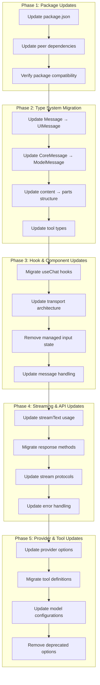

# Design Document

## Overview

This design implements a comprehensive upgrade from AI SDK v4 to v5, addressing all breaking changes identified in the migration guide. The upgrade affects 25+ files across the codebase, including core chat functionality, streaming architecture, type systems, and provider configurations. The design ensures a systematic approach to migration while maintaining existing functionality.

## Architecture

### Migration Strategy



### File Impact Analysis

Based on the codebase analysis, the following files require updates:

#### Core Package Files
- `package.json` - Package version updates
- `app/api/chat/route.ts` - streamText and response method updates
- `app/api/chat/utils.ts` - Type and error handling updates

#### Chat Components & Hooks
- `app/components/chat/use-chat-core.ts` - useChat migration
- `app/components/chat/chat-business-logic.ts` - Message type updates
- `app/components/chat/use-chat-operations.ts` - Type updates
- `app/components/multi-chat/use-multi-chat.ts` - useChat migration
- `app/components/multi-chat/multi-chat.tsx` - Message type updates

#### UI Components
- `app/components/chat/conversation.tsx` - Message type updates
- `app/components/chat/message.tsx` - UIMessage migration
- `app/components/chat/message-assistant.tsx` - Message type updates
- `app/components/chat/message-user.tsx` - Message type updates
- `app/components/chat/tool-invocation.tsx` - Tool UI part updates
- `app/components/chat/sources-list.tsx` - Source part updates
- `app/components/multi-chat/multi-conversation.tsx` - Message type updates

#### Store & Provider Files
- `lib/chat-store/messages/provider.tsx` - Message type updates
- `lib/chat-store/messages/api.ts` - Message type updates
- `app/types/api.types.ts` - Type system updates
- `app/types/database.types.ts` - Attachment type updates

#### Tool & Model Files
- `lib/tools/file-search.ts` - Tool definition updates
- `lib/models/types.ts` - LanguageModelV1 updates
- `lib/openproviders/index.ts` - Provider type updates

#### Project & Share Components
- `app/p/[projectId]/project-view.tsx` - useChat migration
- `app/share/[chatId]/article.tsx` - Message type updates

#### Utility & Helper Files
- `app/components/chat/get-sources.ts` - Message type updates

## Components and Interfaces

### 1. Package Configuration Updates

**Purpose**: Update all AI SDK packages to v5 versions and required peer dependencies.

**Changes**:
```json
{
  "dependencies": {
    "ai": "^5.0.0",
    "@ai-sdk/react": "^2.0.0",
    "@ai-sdk/openai": "^2.0.0",
    "@ai-sdk/anthropic": "^2.0.0",
    "@ai-sdk/google": "^2.0.0",
    "@ai-sdk/mistral": "^2.0.0",
    "@ai-sdk/perplexity": "^2.0.0",
    "@ai-sdk/xai": "^2.0.0",
    "zod": "^3.25.0"
  }
}
```

### 2. Type System Migration

**Purpose**: Update all type references to use v5 naming conventions.

**Key Changes**:
```typescript
// Before (v4)
import { Message, CoreMessage } from 'ai'
import { convertToCoreMessages } from 'ai'

// After (v5)
import { UIMessage, ModelMessage } from 'ai'
import { convertToModelMessages } from 'ai'

// Message structure change
interface MessageV4 {
  id: string
  role: string
  content: string
}

interface MessageV5 {
  id: string
  role: string
  parts: Array<{ type: 'text', text: string } | { type: 'file', url: string, mediaType: string }>
}
```

### 3. useChat Hook Migration

**Purpose**: Update all useChat implementations to use v5 transport architecture.

**Migration Pattern**:
```typescript
// Before (v4)
const { messages, input, handleInputChange, handleSubmit, append, reload } = useChat({
  api: '/api/chat',
  initialMessages,
  onFinish: cacheAndAddMessage,
  onError: handleError,
})

// After (v5)
const [input, setInput] = useState('')
const { messages, sendMessage, regenerate } = useChat({
  transport: new DefaultChatTransport({ api: '/api/chat' }),
  messages: initialMessages,
  onFinish: cacheAndAddMessage,
  onError: handleError,
})

const handleSubmit = (e) => {
  e.preventDefault()
  sendMessage({ text: input })
  setInput('')
}
```

### 4. Streaming Architecture Updates

**Purpose**: Migrate from v4 data streams to v5 UI message streams.

**API Route Changes**:
```typescript
// Before (v4)
const result = streamText({
  model: modelConfig.apiSdk(apiKey, modelSettings),
  system: effectiveSystemPrompt,
  messages: messages,
  tools,
  maxSteps: enableSearch && isGPT5Model ? 10 : 1,
})

return result.toDataStreamResponse({
  getErrorMessage: (error) => extractErrorMessage(error)
})

// After (v5)
const result = streamText({
  model: modelConfig.apiSdk(apiKey, modelSettings),
  system: effectiveSystemPrompt,
  messages: convertToModelMessages(messages),
  tools,
  stopWhen: enableSearch && isGPT5Model ? stepCountIs(10) : undefined,
})

return result.toUIMessageStreamResponse({
  onError: (error) => extractErrorMessage(error)
})
```

### 5. Tool Definition Migration

**Purpose**: Update tool definitions to use v5 inputSchema and property naming.

**Tool Updates**:
```typescript
// Before (v4)
export const fileSearchTool = tool({
  description: 'Advanced search through uploaded documents',
  parameters: z.object({
    query: z.string().describe('Search query'),
    max_results: z.number().optional().default(5),
  }),
  execute: async ({ query, max_results }) => {
    // Implementation
  },
})

// After (v5)
export const fileSearchTool = tool({
  description: 'Advanced search through uploaded documents',
  inputSchema: z.object({
    query: z.string().describe('Search query'),
    max_results: z.number().optional().default(5),
  }),
  execute: async ({ query, max_results }) => {
    // Implementation
  },
})
```

### 6. Provider Configuration Updates

**Purpose**: Update provider configurations to use v5 providerOptions structure.

**Provider Changes**:
```typescript
// Before (v4)
const result = await generateText({
  model: openai('gpt-4'),
  prompt: 'Hello',
  providerMetadata: {
    openai: { store: false },
  },
})

// After (v5)
const result = await generateText({
  model: openai('gpt-4'),
  prompt: 'Hello',
  providerOptions: {
    openai: { store: false },
  },
})
```

## Data Models

### Message Structure Migration
```typescript
// V4 Message Structure
interface MessageV4 {
  id: string
  role: 'user' | 'assistant' | 'system' | 'data'
  content: string
  experimental_attachments?: Attachment[]
}

// V5 UIMessage Structure
interface UIMessageV5 {
  id: string
  role: 'user' | 'assistant' | 'system'
  parts: Array<
    | { type: 'text'; text: string }
    | { type: 'file'; url: string; mediaType: string }
    | { type: 'tool-call'; toolName: string; input: any; output?: any }
  >
}
```

### Tool Call Structure Migration
```typescript
// V4 Tool Structure
interface ToolCallV4 {
  toolCallId: string
  toolName: string
  args: any
  result?: any
}

// V5 Tool Structure
interface ToolCallV5 {
  toolCallId: string
  toolName: string
  input: any
  output?: any
}
```

## Error Handling

### Migration Error Types
1. **Type Compilation Errors**: Mismatched type references during migration
2. **Runtime Errors**: Incorrect API usage after migration
3. **Import Errors**: Missing or incorrect package imports
4. **Configuration Errors**: Invalid provider or model configurations

### Error Recovery Strategies
1. **Incremental Migration**: Migrate one file at a time to isolate issues
2. **Type Checking**: Run TypeScript compilation after each major change
3. **Fallback Patterns**: Maintain backward compatibility where possible
4. **Comprehensive Testing**: Test each migrated component thoroughly

## Testing Strategy

### Migration Verification Tests
- **Type Compilation**: Ensure all TypeScript errors are resolved
- **Unit Tests**: Verify individual component functionality
- **Integration Tests**: Test complete chat flows end-to-end
- **API Tests**: Verify streaming and response handling
- **UI Tests**: Ensure chat interface continues to work

### Test Coverage Areas
- Chat message sending and receiving
- File upload and attachment handling
- Tool calling and execution
- Streaming response processing
- Error handling and recovery
- Provider configuration and model usage

## Implementation Phases

### Phase 1: Package and Type Updates (Foundation)
- Update package.json with v5 versions
- Update all type imports and references
- Fix basic compilation errors
- Update message structure throughout codebase

### Phase 2: Hook and Component Migration (Core Functionality)
- Migrate all useChat implementations
- Update transport architecture
- Remove managed input state
- Update message handling patterns

### Phase 3: Streaming and API Updates (Communication Layer)
- Update streamText usage in API routes
- Migrate response methods
- Update stream protocol handling
- Update error handling patterns

### Phase 4: Tool and Provider Updates (Integration Layer)
- Update tool definitions and usage
- Migrate provider configurations
- Remove deprecated options
- Update model settings

### Phase 5: Testing and Validation (Quality Assurance)
- Run comprehensive test suite
- Perform manual testing of key flows
- Validate performance and functionality
- Document any remaining issues or limitations