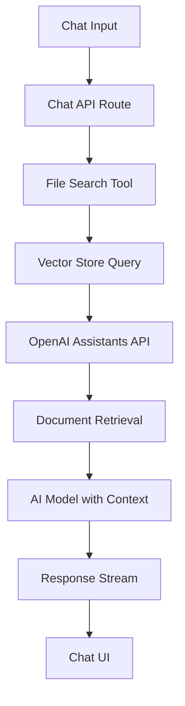

# Design Document

## Overview

This design addresses the critical issues preventing proper chat responses and file search functionality in the RoboRail Assistant. The main problems identified are:

1. File search tool is disabled due to schema issues
2. Incorrect OpenAI vector store API usage
3. Missing error handling for vector store operations
4. Need for proper integration between chat and file search systems

## Architecture

### Current Architecture Issues

The current implementation has several architectural problems:

- **Disabled File Search**: The file search tool is commented out in `/app/api/chat/route.ts` due to schema issues
- **Incorrect API Usage**: Using `openai.vectorStores.search()` which doesn't exist in the OpenAI SDK
- **Missing Fallback**: No graceful degradation when file search fails

### Proposed Architecture



## Components and Interfaces

### 1. Chat API Route Enhancement

**File**: `app/api/chat/route.ts`

**Changes Required**:
- Re-enable file search tool with proper schema (always enabled)
- Add error handling for file search operations
- Implement fallback mechanism when file search fails
- Remove conditional file search logic - it should always be available

**Interface**:
```typescript
interface ChatRequest {
  messages: UIMessage[];
  chatId: string;
  userId: string;
  model: string;
  isAuthenticated: boolean;
  systemPrompt: string;
  enableSearch: boolean;
  reasoningEffort?: 'low' | 'medium' | 'high';
}

interface FileSearchToolConfig {
  type: 'file_search';
  file_search?: {
    max_num_results?: number;
    ranking_options?: {
      ranker?: string;
      score_threshold?: number;
    };
  };
}
```

### 2. Vector Store Operations Fix

**File**: `lib/retrieval/query-rewriting.ts`

**Current Issue**: Using non-existent `openai.vectorStores.search()` API

**Solution**: Use AI SDK's built-in file search support with OpenAI provider

**New Interface**:
```typescript
// Use AI SDK's built-in file search configuration
interface ModelSettings {
  enableSearch?: boolean;
  reasoningEffort?: 'low' | 'medium' | 'high';
  headers?: Record<string, string>;
}

// AI SDK handles vector store operations internally
interface FileSearchConfig {
  vectorStoreIds?: string[];
  maxNumResults?: number;
  rankingOptions?: {
    ranker?: string;
    scoreThreshold?: number;
  };
}
```

### 3. File Search Tool Schema

**File**: `lib/tools/file-search.ts`

**Schema Fix**:
```typescript
const fileSearchSchema = z.object({
  query: z.string().describe('Search query to find relevant information'),
  max_results: z.number().optional().default(5),
  vector_store_id: z.string().optional(),
});
```

### 4. Error Handling Enhancement

**Component**: Error handling middleware

**Features**:
- Graceful degradation when vector stores are unavailable
- Clear error messages for API key issues
- Fallback to regular chat when file search fails

## Data Models

### Vector Store Configuration

```typescript
interface VectorStoreConfig {
  id: string;
  name: string;
  file_ids: string[];
  chunking_strategy: {
    type: 'static';
    static: {
      max_chunk_size_tokens: number;
      chunk_overlap_tokens: number;
    };
  };
}
```

### File Search Response

```typescript
interface FileSearchResponse {
  success: boolean;
  results: Array<{
    content: string;
    score: number;
    file_id: string;
    file_name: string;
    metadata?: Record<string, unknown>;
  }>;
  query: string;
  total_results: number;
  error?: string;
}
```

## Error Handling

### 1. Vector Store API Errors

**Strategy**: Implement proper error handling with fallback

```typescript
// Use AI SDK's built-in file search support
const modelWithFileSearch = openai.chat('gpt-4o-mini', {
  // Enable file search through model settings
  experimental_toolResources: {
    fileSearch: {
      vectorStoreIds: [vectorStoreId],
      maxNumResults: 10,
      rankingOptions: {
        ranker: 'default_2024_08_21',
        scoreThreshold: 0.5,
      },
    },
  },
});

// AI SDK handles the file search integration automatically
const result = await streamText({
  model: modelWithFileSearch,
  system: systemPrompt,
  messages: uiMessages,
  tools: {
    // Custom tools can still be added alongside file search
  },
});
```

### 2. File Search Integration via AI SDK

**Strategy**: Use AI SDK's built-in file search support

```typescript
// Configure model with file search capabilities
const configureModelWithFileSearch = (apiKey: string, vectorStoreIds: string[]) => {
  return openai.chat('gpt-4o-mini', {
    experimental_toolResources: {
      fileSearch: {
        vectorStoreIds,
        maxNumResults: 10,
        rankingOptions: {
          ranker: 'default_2024_08_21',
          scoreThreshold: 0.5,
        },
      },
    },
  });
};

// In chat API route
const modelWithFileSearch = configureModelWithFileSearch(apiKey, [vectorStoreId]);
```

### 3. Graceful Degradation

**Strategy**: Continue chat functionality even when file search fails

```typescript
// In chat API route
try {
  // Get or create default vector store
  const vectorStoreId = await getOrCreateDefaultVectorStore(apiKey);
  
  // Configure model with file search
  const modelWithFileSearch = openai.chat(model, {
    experimental_toolResources: {
      fileSearch: {
        vectorStoreIds: [vectorStoreId],
        maxNumResults: 10,
        rankingOptions: {
          ranker: 'default_2024_08_21',
          scoreThreshold: 0.5,
        },
      },
    },
  });
  
  const result = streamText({
    model: modelWithFileSearch,
    system: effectiveSystemPrompt,
    messages: uiMessages,
    onError: (err) => {
      console.error('Streaming error:', err);
    }
  });
  
  return result.toTextStreamResponse();
} catch (error) {
  // Fallback to regular model without file search
  console.warn('File search setup failed, falling back to regular chat');
  const regularModel = openai.chat(model);
  return streamText({
    model: regularModel,
    system: effectiveSystemPrompt,
    messages: uiMessages,
  }).toTextStreamResponse();
}
```

## Testing Strategy

### 1. Unit Tests

**File Search Tool Tests**:
- Test schema validation
- Test API integration with mocked OpenAI responses
- Test error handling scenarios

**Vector Store Tests**:
- Test correct API usage
- Test response parsing
- Test error scenarios

### 2. Integration Tests

**Chat API Tests**:
- Test chat with file search enabled
- Test chat with file search disabled
- Test fallback behavior when file search fails
- Test different AI models

### 3. End-to-End Tests

**User Workflow Tests**:
- Upload documents and verify vector store creation
- Send messages and verify file search integration
- Test error scenarios and user experience

### 4. API Key Tests

**Provider Tests**:
- Test with valid API keys
- Test with invalid API keys
- Test error message clarity

## Implementation Priority

### Phase 1: Critical Fixes
1. Fix vector store API usage in `lib/retrieval/query-rewriting.ts`
2. Re-enable file search tool in `app/api/chat/route.ts`
3. Add proper error handling and fallback

### Phase 2: Enhancement
1. Improve file upload and vector store management
2. Add better user feedback for file search operations
3. Optimize chunking and retrieval strategies

### Phase 3: Testing & Monitoring
1. Add comprehensive test coverage
2. Implement monitoring for file search operations
3. Add performance metrics and optimization