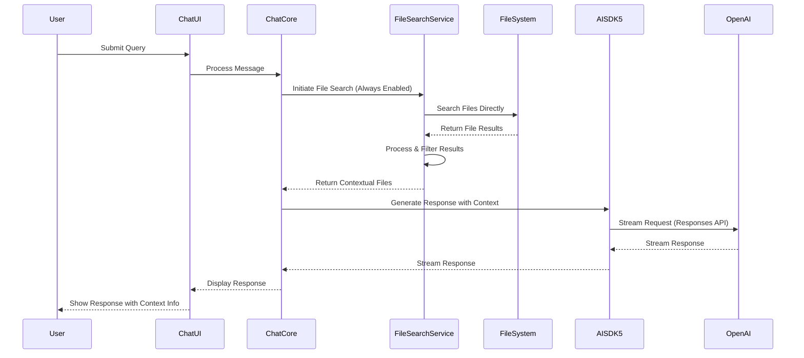
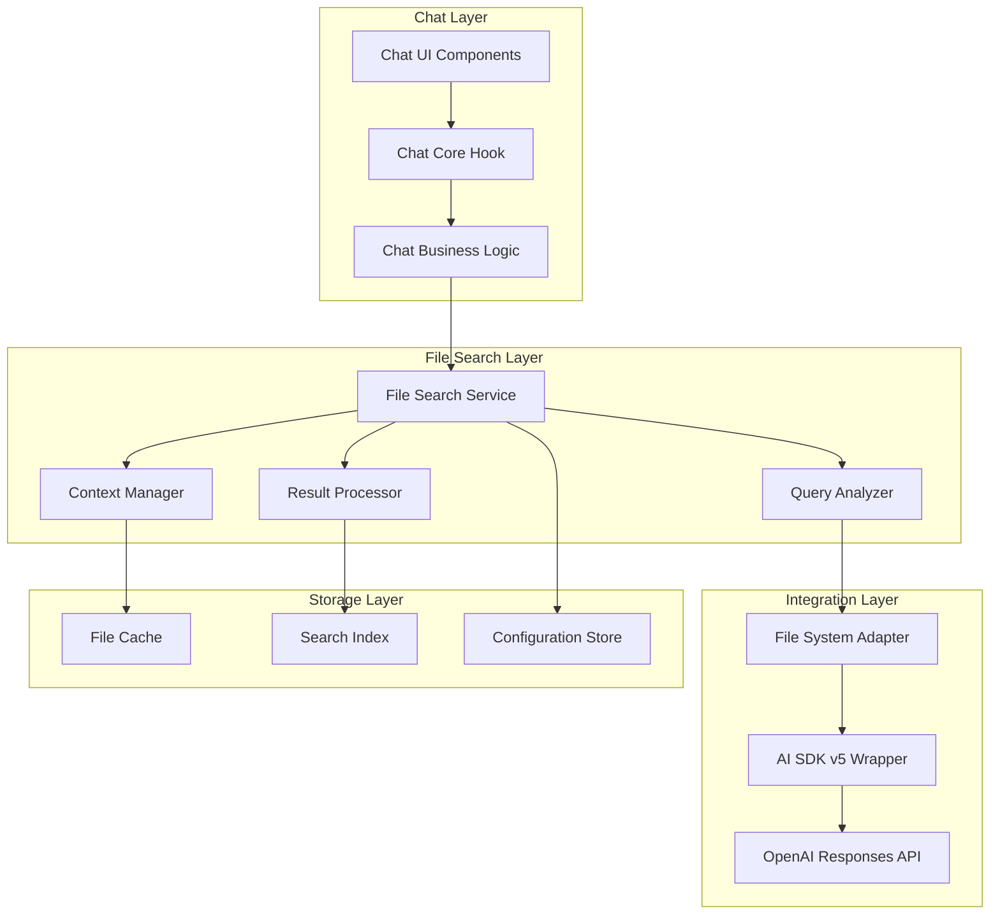

# Design Document

## Overview

This design implements a file-search-first query processing system that automatically searches through relevant files before generating responses. The system integrates with the existing chat infrastructure, upgrading to AI SDK v5 and leveraging OpenAI's responses API with always-enabled file search.

The core principle is to enhance user queries with contextual information from their codebase, making responses more accurate and relevant to their specific project context. File search is always active and cannot be disabled.

## Architecture

### High-Level Flow



### Component Architecture



## Components and Interfaces

### 1. File Search Service

**Purpose**: Orchestrates the file search process and manages search lifecycle.

**Interface**:
```typescript
interface FileSearchService {
  searchFiles(query: string, options: SearchOptions): Promise<SearchResult>
  analyzeQuery(query: string): Promise<QueryAnalysis>
  processResults(results: RawSearchResult[]): Promise<ProcessedResult[]>
  getSearchConfiguration(): SearchConfiguration
}

interface SearchOptions {
  maxFiles?: number
  fileTypes?: string[]
  timeout?: number
  enableCache?: boolean
  searchScope?: 'workspace' | 'project' | 'custom'
}

interface SearchResult {
  files: ContextualFile[]
  metadata: SearchMetadata
  processingTime: number
  cacheHit: boolean
}
```

### 2. Query Analyzer

**Purpose**: Analyzes user queries to determine optimal search strategy and file relevance.

**Interface**:
```typescript
interface QueryAnalyzer {
  analyzeIntent(query: string): Promise<QueryIntent>
  extractKeywords(query: string): string[]
  determineFileTypes(query: string): string[]
  calculateRelevanceScore(query: string, fileContent: string): number
}

interface QueryIntent {
  type: 'code' | 'documentation' | 'configuration' | 'general'
  confidence: number
  suggestedFileTypes: string[]
  searchTerms: string[]
}
```

### 3. File System Adapter

**Purpose**: Provides direct file system access for searching and reading files.

**Interface**:
```typescript
interface FileSystemAdapter {
  searchFiles(pattern: string, options: FileSearchOptions): Promise<FileSearchResult[]>
  readFile(path: string): Promise<string>
  listDirectory(path: string): Promise<string[]>
  getFileStats(path: string): Promise<FileStats>
  watchFiles(patterns: string[]): FileWatcher
}

interface FileSearchOptions {
  includePattern?: string
  excludePattern?: string
  maxResults?: number
  caseSensitive?: boolean
  maxDepth?: number
}
```

### 4. AI SDK v5 Integration

**Purpose**: Handles streaming responses with file context using AI SDK v5 and OpenAI responses API.

**Interface**:
```typescript
interface EnhancedChatService {
  streamWithContext(
    messages: Message[],
    context: FileContext,
    options: StreamOptions
  ): Promise<StreamingResponse>
  
  prepareContextualPrompt(
    originalPrompt: string,
    fileContext: FileContext
  ): string
}

interface FileContext {
  files: ContextualFile[]
  searchQuery: string
  relevanceScores: Record<string, number>
  totalTokens: number
}

interface StreamOptions {
  model: string
  temperature?: number
  maxTokens?: number
  reasoningEffort?: 'low' | 'medium' | 'high'
  // File search is always enabled - no toggle needed
}
```

### 5. Context Manager

**Purpose**: Manages file context, token limits, and content optimization.

**Interface**:
```typescript
interface ContextManager {
  optimizeContext(files: ContextualFile[], maxTokens: number): ContextualFile[]
  extractRelevantSections(file: ContextualFile, query: string): string
  calculateTokenUsage(content: string): number
  prioritizeFiles(files: ContextualFile[], query: string): ContextualFile[]
}

interface ContextualFile {
  path: string
  content: string
  relevanceScore: number
  fileType: string
  lastModified: Date
  tokenCount: number
  extractedSections?: string[]
}
```

## Data Models

### Search Configuration
```typescript
interface SearchConfiguration {
  // File search is always enabled - no toggle
  timeout: number
  maxFiles: number
  maxTokensPerFile: number
  totalMaxTokens: number
  fileTypeFilters: string[]
  excludePatterns: string[]
  cacheEnabled: boolean
  cacheTTL: number
  searchDepth: number
}
```

### Search Metadata
```typescript
interface SearchMetadata {
  queryAnalysis: QueryAnalysis
  searchDuration: number
  filesScanned: number
  filesReturned: number
  cacheHit: boolean
  fileSystemOperations: string[]
  tokenUsage: {
    context: number
    response: number
    total: number
  }
}
```

### UI State Extensions
```typescript
interface ChatUIState {
  // Existing state...
  fileSearchState: {
    isSearching: boolean
    searchProgress?: string
    filesFound: number
    searchError?: string
    contextFiles: ContextualFile[]
  }
}
```

## Error Handling

### Error Types
1. **Search Timeout**: When file search exceeds configured timeout
2. **File System Error**: When file system access fails or is restricted
3. **Context Overflow**: When file context exceeds token limits
4. **File Access Error**: When files cannot be read or accessed
5. **AI SDK Error**: When streaming or API calls fail

### Error Recovery Strategies
1. **Graceful Degradation**: Continue with general knowledge if file search fails
2. **Partial Context**: Use available files if some fail to load
3. **Retry Logic**: Implement exponential backoff for transient failures
4. **User Notification**: Clear messaging about search status and fallbacks

### Error Handling Implementation
```typescript
interface ErrorHandler {
  handleSearchTimeout(query: string): Promise<SearchResult>
  handleFileSystemError(error: Error, query: string): Promise<SearchResult>
  handleContextOverflow(files: ContextualFile[]): ContextualFile[]
  handleStreamingError(error: Error): Promise<void>
}
```

## Testing Strategy

### Unit Tests
- **Query Analyzer**: Test intent detection and keyword extraction
- **Context Manager**: Test token counting and content optimization
- **File System Adapter**: Test file system integration and error handling
- **File Search Service**: Test search orchestration and result processing

### Integration Tests
- **End-to-End Search Flow**: Test complete search-to-response pipeline
- **AI SDK v5 Integration**: Test streaming with file context
- **File System Integration**: Test direct file system interactions
- **Error Scenarios**: Test timeout, unavailability, and overflow handling

### Performance Tests
- **Search Performance**: Measure search time across different file sizes
- **Context Processing**: Test token optimization performance
- **Streaming Performance**: Measure response time with various context sizes
- **Memory Usage**: Monitor memory consumption during large file processing

### Test Data Requirements
- Sample codebases of varying sizes
- Different file types (code, docs, config)
- Edge cases (empty files, binary files, large files)
- File system permission scenarios for testing

## Implementation Phases

### Phase 1: Core Infrastructure
- Upgrade to AI SDK v5
- Implement basic file search service (always enabled)
- Create file system adapter
- Add search configuration management

### Phase 2: Search Intelligence
- Implement query analyzer
- Add context manager with token optimization
- Create result processing and ranking
- Add caching layer

### Phase 3: UI Integration
- Update chat components for search status
- Add file context display
- Implement search configuration UI
- Add error state handling

### Phase 4: Advanced Features
- Multi-file search optimization
- Advanced query rewriting
- Performance monitoring
- Analytics and usage tracking