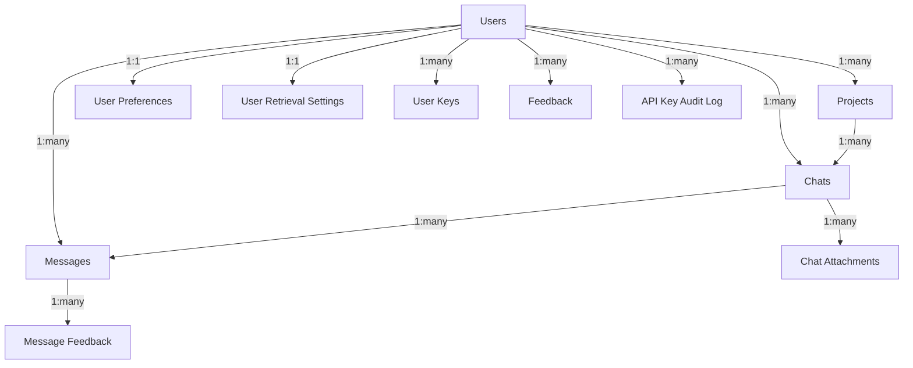

# Enhanced Drizzle ORM Schema for RoboRail

## Overview

This document summarizes the comprehensive Drizzle ORM schema enhancement completed for the RoboRail application. The schema now includes all identified tables with proper relationships, indexing, and TypeScript types.

## Enhanced Schema Components

### 1. Core Tables

#### Users Table (`users`)
- **Enhanced with**: `displayName`, `profileImage`, `email` (varchar), `lastActiveAt`
- **Features**: Anonymous user support, daily message tracking, favorite models
- **Indexes**: Email, display name, last active, anonymous flag

#### Projects Table (`projects`) 
- **Purpose**: Organize chats into projects
- **Fields**: `id`, `userId`, `name`, `description`, `createdAt`, `updatedAt`
- **Relationships**: One-to-many with chats
- **Indexes**: User ID, project name, creation date

#### Chats Table (`chats`)
- **Enhanced with**: `projectId` foreign key relationship
- **Features**: Public/private chats, system prompts, model tracking
- **Indexes**: User ID, project ID, model, creation date, public flag

#### Messages Table (`messages`)
- **Enhanced with**: `parts` (JSONB array), `langsmithRunId`
- **Features**: Structured content parts, reasoning effort levels, LangSmith tracing
- **Indexes**: Chat ID, user ID, role, creation date, model, reasoning effort

### 2. Feedback Tables

#### Message Feedback (`message_feedback`)
- **Purpose**: User feedback on specific messages
- **Fields**: Feedback type (enum), comment, rating
- **Indexes**: Message ID, user ID, feedback type

#### General Feedback (`feedback`)
- **Purpose**: General application feedback
- **Fields**: User ID, message, creation date
- **Indexes**: User ID, creation date

### 3. User Settings Tables

#### User Preferences (`user_preferences`)
- **Purpose**: UI and behavior preferences
- **Fields**: Layout, prompt suggestions, tool invocations, conversation previews, multi-model settings, hidden models
- **Features**: Per-user customization of interface behavior

#### User Retrieval Settings (`user_retrieval_settings`)
- **Purpose**: RAG system configuration
- **Fields**: Enable retrieval, max results, similarity threshold, preferred/excluded sources
- **Features**: Customizable document retrieval behavior
- **Constraint**: One setting per user (unique constraint)

### 4. Security Tables

#### User Keys (`user_keys`)
- **Purpose**: Encrypted storage of user API keys
- **Enhanced with**: Provider enum type, unique constraint per user/provider
- **Features**: Encrypted key storage, activity tracking, provider validation
- **Indexes**: User ID, provider, unique user+provider combination
- **Legacy Alias**: `apiKeys` for backward compatibility

#### API Key Audit Log (`api_key_audit_log`)
- **Purpose**: Security audit trail for API key operations
- **Fields**: User ID, provider, action, IP address, user agent, success status, error messages
- **Features**: Complete audit trail for security monitoring
- **Indexes**: User ID, provider, action, creation date, success status

### 5. File Management Tables

#### Chat Attachments (`chat_attachments`)
- **Purpose**: File attachments for chats
- **Fields**: Chat ID, file name, type, size, path, upload timestamp
- **Features**: File metadata tracking, chat association
- **Indexes**: Chat ID, file type, upload date

## Enums

### Provider Enum
```typescript
'openai' | 'anthropic' | 'google' | 'xai' | 'groq' | 'deepseek' | 'mistral' | 'perplexity' | 'ollama'
```

### Reasoning Effort Enum  
```typescript
'low' | 'medium' | 'high'
```

### Feedback Type Enum
```typescript
'positive' | 'negative'
```

## Key Relationships



## Performance Optimizations

### Comprehensive Indexing Strategy
- **Primary Keys**: All tables use UUID primary keys with `defaultRandom()`
- **Foreign Keys**: Indexed on all foreign key columns
- **Query Patterns**: Indexes on commonly queried fields (email, creation dates, status flags)
- **Composite Indexes**: Unique constraints for user+provider combinations

### Query Optimization Features
- **Cascading Deletes**: Proper cleanup when users are deleted
- **Soft Deletes**: Option for `isActive` flags where needed
- **Timestamps**: Automatic `createdAt` and `updatedAt` with triggers

## TypeScript Integration

### Comprehensive Type Exports
- **Select Types**: `User`, `Project`, `Chat`, `Message`, etc.
- **Insert Types**: `NewUser`, `NewProject`, `NewChat`, `NewMessage`, etc.
- **Enum Types**: `ReasoningEffort`, `FeedbackType`, `Provider`
- **Complex Types**: `MessagePart`, `MessageMetadata`
- **Union Types**: `DatabaseTable` for generic operations

### Type Safety Features
- **Enum Validation**: Strict provider and feedback type validation
- **JSONB Typing**: Properly typed JSONB fields for parts and metadata
- **Legacy Compatibility**: Backward compatible aliases for existing code

## Migration Strategy

### Migration Files Created
1. `20250125_comprehensive_drizzle_schema.sql` - Complete schema alignment
2. Enhanced existing migrations with new table support

### Migration Features
- **Idempotent**: Can be run multiple times safely
- **Backward Compatible**: Preserves existing data
- **Comprehensive**: Includes all tables, indexes, and constraints
- **RLS Enabled**: Row Level Security policies for all sensitive tables

## Security Features

### Row Level Security (RLS)
- **User Data Isolation**: Users can only access their own data
- **Guest User Support**: Special policies for anonymous users
- **Audit Trail**: Complete logging of API key operations

### Data Protection
- **Encrypted Storage**: API keys stored with encryption
- **Access Logging**: All key usage tracked in audit log
- **IP and User Agent Tracking**: Security monitoring capabilities

## Usage Examples

### Creating a New Chat with Project
```typescript
import { db } from '@/lib/db/drizzle'
import { chats, projects } from '@/lib/db/schema'

const newChat = await db.insert(chats).values({
  userId: 'user-uuid',
  projectId: 'project-uuid',
  title: 'New Chat',
  model: 'gpt-4'
}).returning()
```

### Querying Messages with Relationships
```typescript
const chatWithMessages = await db.query.chats.findFirst({
  where: eq(chats.id, chatId),
  with: {
    messages: {
      with: {
        feedback: true
      }
    },
    project: true
  }
})
```

### Managing User Preferences
```typescript
const preferences = await db.query.userPreferences.findFirst({
  where: eq(userPreferences.userId, userId)
})
```

## Migration Validation

The schema includes comprehensive validation through the existing migration `20250124_validate_schema_integrity.sql` which checks:
- All required tables exist
- Critical columns are present
- Foreign key relationships are properly configured
- RLS is enabled on sensitive tables
- Data integrity (no orphaned records)

## Conclusion

The enhanced Drizzle ORM schema provides:
✅ **Complete Coverage** - All identified tables implemented
✅ **Type Safety** - Comprehensive TypeScript integration
✅ **Performance** - Optimized indexing strategy
✅ **Security** - RLS and audit logging
✅ **Maintainability** - Clear relationships and documentation
✅ **Backward Compatibility** - Legacy aliases and migration safety

This schema is now ready to support all RoboRail application features with proper data modeling, relationships, and performance optimization.