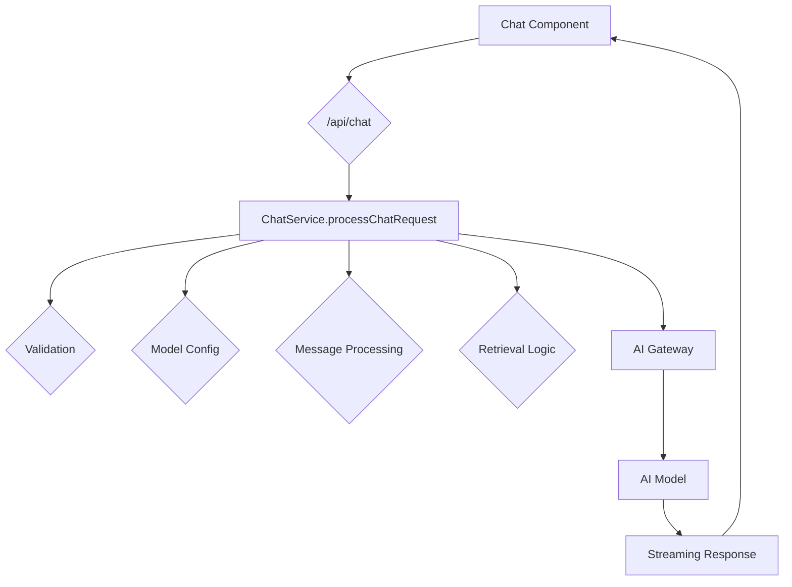
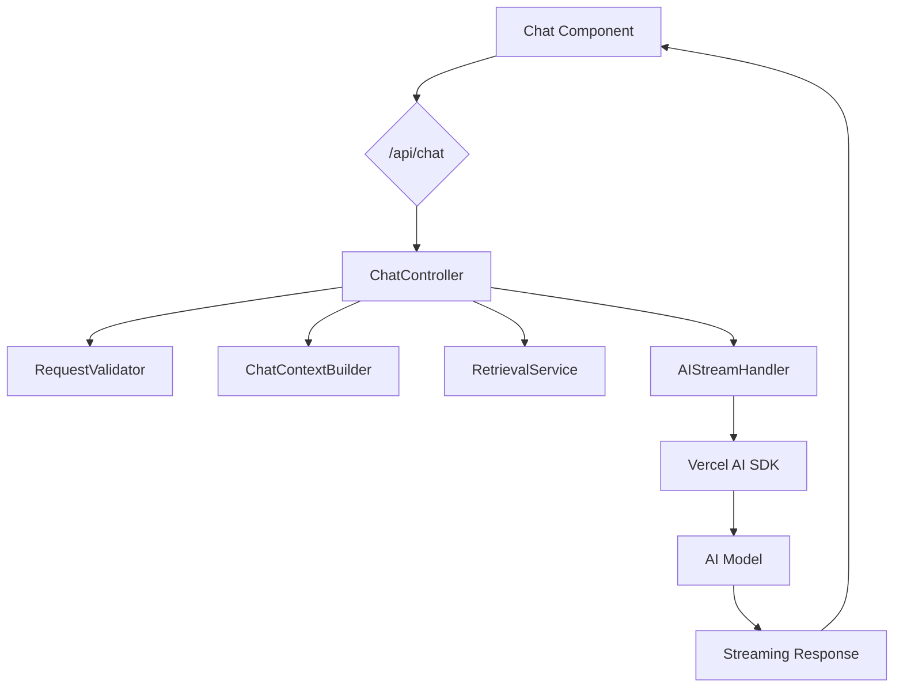

# Architect's Refactoring and Architectural Improvement Plan

## 1. Executive Summary & Prioritized Plan

The codebase is robust and feature-rich, but suffers from high complexity in key areas. This plan prioritizes changes that will have the greatest impact on maintainability and scalability with the most reasonable effort.

| Priority | Task                               | Impact   | Effort | Recommendation                                                                                             |
| :------- | :--------------------------------- | :------- | :----- | :--------------------------------------------------------------------------------------------------------- |
| **High** | Refactor `ChatService`             | High     | High   | Decompose the `processChatRequest` method into smaller, single-responsibility services.                    |
| **High** | Implement Schema-Based Validation  | High     | Medium | Use Zod to validate all API inputs, starting with the main chat route.                                     |
| **High** | Simplify AI Gateway                | High     | Medium | Remove redundant custom gateway logic and rely on the Vercel AI SDK's native capabilities.                  |
| **Medium** | Eliminate `any` Types              | High     | Medium | Replace `any` types in Supabase clients and other areas with specific, generated types.                    |
| **Medium** | Refactor Dynamic Imports           | Medium   | Low    | Replace dynamic `require()` and `import()` calls in `ChatService` with static, top-level imports.        |
| **Low**    | Decompose `Chat` UI Component      | Medium   | High   | Break down the main `Chat` component into smaller, more focused sub-components.                            |
| **Low**    | Conduct Dependency Audit           | Medium   | Low    | Use a tool like `depcheck` to identify and remove unused dependencies from `package.json`.                 |

---

## 2. Detailed Analysis & Recommendations

### 2.1. Architecture and Structure Improvements

#### A. **Refactor `ChatService` (High Priority)**

*   **Problem:** The `ChatService.processChatRequest` method is a "God method" that violates the Single Responsibility Principle. It handles validation, model configuration, message processing, retrieval, and streaming, making it difficult to test and maintain.
*   **Recommendation:** Decompose the `ChatService` into a set of smaller, more focused services that are orchestrated by a simplified `ChatController`. This will improve modularity and testability.

    *   **Proposed New Services:**
        *   `RequestValidator`: Validates incoming chat requests using Zod.
        *   `ChatContextBuilder`: Gathers and builds the context for a chat request (user data, model config, system prompts).
        *   `RetrievalService`: Handles all logic related to retrieval-augmented generation.
        *   `AIStreamHandler`: Manages the streaming response from the AI model.

#### B. **Simplify AI Gateway (High Priority)**

*   **Problem:** The custom `AIGateway` in `lib/ai/gateway.ts` duplicates functionality already provided by the Vercel AI SDK, which is designed to handle gateway routing automatically. This creates unnecessary complexity.
*   **Recommendation:** Remove the custom gateway logic and rely entirely on the Vercel AI SDK. This will simplify the codebase and reduce the potential for configuration conflicts.

#### C. **Decompose `Chat` UI Component (Low Priority)**

*   **Problem:** The `Chat` component in `components/app/chat/chat.tsx` is a large and complex component that manages a significant amount of the application's client-side logic.
*   **Recommendation:** While the use of custom hooks is a good pattern, the component itself could be further broken down into smaller, more specialized components. For example, the onboarding and conversation views could be extracted into their own components.

### 2.2. Code Quality Analysis

#### A. **Implement Schema-Based Validation (High Priority)**

*   **Problem:** The API route in `app/api/chat/route.ts` does not perform robust validation on the incoming request body, which could lead to runtime errors.
*   **Recommendation:** Use a schema-based validation library like Zod to define a clear schema for the `ChatRequest` and validate all incoming requests against it. This will ensure type safety and provide clear error messages.

#### B. **Eliminate `any` Types (Medium Priority)**

*   **Problem:** The Supabase clients in `lib/supabase/client.ts` and `lib/supabase/server.ts` use `any` as a return type, which undermines the benefits of TypeScript.
*   **Recommendation:** Generate specific types for your Supabase schema and use them throughout the application. This will improve type safety and developer experience.

#### C. **Refactor Dynamic Imports (Medium Priority)**

*   **Problem:** The `ChatService` uses dynamic `require()` and `import()` statements, which is an anti-pattern in core application logic. This can negatively impact performance and makes static analysis more difficult.
*   **Recommendation:** Replace all dynamic imports with static, top-level imports. This will improve performance and make the code easier to reason about.

### 2.3. Dependency and Import Optimization

#### A. **Conduct Dependency Audit (Low Priority)**

*   **Problem:** The `package.json` file contains a large number of dependencies, and it is likely that some are no longer in use.
*   **Recommendation:** Use a tool like `depcheck` to identify and remove any unused dependencies. This will reduce the bundle size and improve application performance.

---

## 3. Architectural Diagrams (Mermaid)

### 3.1. Current Chat Request Flow

### 3.2. Proposed Refactored Chat Request Flow

