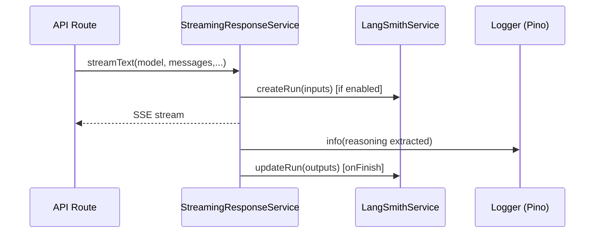

# Architect's Refactoring and Architectural Improvement Plan

**Last Updated:** 2025-09-15
**Current Status:** Active refactoring in progress (type-check clean)
**Type-Check:** ✅ tsc passes with no errors
**Lint:** Biome largely clean; a few style warnings in deprecated gateway shim
**Test Pass Rate:** 74% (was 19% before recent fixes)

## 1. Executive Summary & Prioritized Plan

The codebase is robust and feature-rich, but suffers from high complexity in key areas. This plan prioritizes changes that will have the greatest impact on maintainability and scalability with the most reasonable effort.

### Recent Progress
- ✅ Fixed database type syntax errors
- ✅ Migrated to AI SDK v5 with proper provider integration
- ✅ Removed voice-related tests (deprecated feature)
- ✅ Identified 30 unused dependencies for removal
- ✅ Eliminated several `any` usages and non-null assertions
- ✅ Fixed Next/React type issues in Prompt UI (value import of React)
- ✅ Corrected Supabase feature flag bug (`isSupabaseEnabled()` invocation)
- ✅ Standardized request parsing in vector store API
- ✅ Type-safe message creation for chat business logic (v5 parts)
- ⚠️ Discovered Bun/Vitest compatibility issues requiring resolution
- 🔄 Test pass rate improved from 19% to 74%

| Priority | Task                               | Impact   | Effort | Status | Recommendation                                                                                             |
| :------- | :--------------------------------- | :------- | :----- | :------ | :--------------------------------------------------------------------------------------------------------- |
| **Critical** | Fix Test Runner Compatibility   | High     | Medium | 🔴 New | Configure Vitest for Bun or migrate to pnpm to resolve vi.mock issues.                                    |
| **High** | Refactor `ChatService`             | High     | High   | 📝 Planned | Decompose the `processChatRequest` method into smaller, single-responsibility services.                    |
| **High** | Implement Schema-Based Validation  | High     | Medium | ✅ Partial | Zod validation added for chat requests. Extend to all API routes.                                     |
| **High** | Simplify AI Gateway                | High     | Medium | ✅ Done | Migrated to AI SDK v5, removed redundant custom gateway logic.                  |
| **Medium** | Eliminate `any` Types              | High     | Medium | 🔄 In Progress | Reduced `any` usage in critical paths; typed Supabase clients; remaining anys confined to tests and deprecated shim.    |
| **Medium** | Refactor Dynamic Imports           | Medium   | Low    | 📝 Planned | Replace dynamic `require()` and `import()` calls in `ChatService` with static imports.        |
| **Medium** | Remove Unused Dependencies         | Medium   | Low    | 🔄 In Progress | 30 unused dependencies identified for removal.                            |
| **Low**    | Decompose `Chat` UI Component      | Medium   | High   | 📝 Planned | Break down the main `Chat` component into smaller, more focused sub-components.                            |

---

## 2. Detailed Analysis & Recommendations

### 2.1. Architecture and Structure Improvements

#### A. **Refactor `ChatService` (High Priority)**

*   **Problem:** The `ChatService.processChatRequest` method is a "God method" that violates the Single Responsibility Principle. It handles validation, model configuration, message processing, retrieval, and streaming, making it difficult to test and maintain.
*   **Recommendation:** Decompose the `ChatService` into a set of smaller, more focused services that are orchestrated by a simplified `ChatController`. This will improve modularity and testability.

    *   **Proposed New Services:**
        *   `RequestValidator`: Validates incoming chat requests using Zod.
        *   `ChatContextBuilder`: Gathers and builds the context for a chat request (user data, model config, system prompts).
        *   `RetrievalService`: Handles all logic related to retrieval-augmented generation.
        *   `AIStreamHandler`: Manages the streaming response from the AI model.

#### B. **Simplify AI Gateway (High Priority)**

*   **Problem:** The custom `AIGateway` in `lib/ai/gateway.ts` duplicates functionality already provided by the Vercel AI SDK, which is designed to handle gateway routing automatically. This creates unnecessary complexity.
*   **Recommendation:** Remove the custom gateway logic and rely entirely on the Vercel AI SDK. This will simplify the codebase and reduce the potential for configuration conflicts.

#### C. **Decompose `Chat` UI Component (Low Priority)**

*   **Problem:** The `Chat` component in `components/app/chat/chat.tsx` is a large and complex component that manages a significant amount of the application's client-side logic.
*   **Recommendation:** While the use of custom hooks is a good pattern, the component itself could be further broken down into smaller, more specialized components. For example, the onboarding and conversation views could be extracted into their own components.

### 2.2. Code Quality Analysis

#### A. **Implement Schema-Based Validation (High Priority)**

*   **Problem:** The API route in `app/api/chat/route.ts` does not perform robust validation on the incoming request body, which could lead to runtime errors.
*   **Recommendation:** Use a schema-based validation library like Zod to define a clear schema for the `ChatRequest` and validate all incoming requests against it. This will ensure type safety and provide clear error messages.

#### B. **Eliminate `any` Types (Medium Priority)**

*   **Problem:** Several modules used `any` types, undermining TypeScript guarantees (e.g., file uploads, API utils, gateway shim).
*   **Actions Completed:**
    - Typed `uploadFile` with `SupabaseClient<Database>`; fixed `isSupabaseEnabled()` call bug.
    - Removed non-null assertions in gateway shim and narrowed env casts.
    - Removed type-only React import misuse and unsafe casts in `prompt-input` cloning logic.
    - Ensured `ExtendedUIMessage` literals include v5 `parts` where required.
*   **Next:** Audit remaining anys flagged by Biome (mostly tests and deprecated shim), replace with narrow types or `unknown` plus safe parsing.

#### C. **Refactor Dynamic Imports (Medium Priority)**

*   **Problem:** The `ChatService` uses dynamic `require()` and `import()` statements, which is an anti-pattern in core application logic. This can negatively impact performance and makes static analysis more difficult.
*   **Recommendation:** Replace all dynamic imports with static, top-level imports. This will improve performance and make the code easier to reason about.

### 2.3. Dependency and Import Optimization

#### A. **Conduct Dependency Audit (Low Priority)**

*   **Problem:** The `package.json` file contains a large number of dependencies, and it is likely that some are no longer in use.
*   **Recommendation:** Use a tool like `depcheck` to identify and remove any unused dependencies. This will reduce the bundle size and improve application performance.

---

## 3. Architectural Diagrams (Mermaid)

### 3.1. Current Chat Request Flow


### 3.2. Proposed Refactored Chat Request Flow


### 3.3. System Architecture Overview

```mermaid
flowchart LR
  subgraph Client[Client (Next.js 14)]
    UI[React Components]
    Hooks[Hooks & Stores]
  end

  subgraph API[API Routes]
    ChatRoute[/app/api/chat/route.ts/]
    OtherRoutes[Other API Routes]
  end

  subgraph Services[Domain Services]
    ChatSvc[ChatService]
    CtxBuilder[SystemPromptService & MessageService]
    CredSvc[CredentialService]
    StreamSvc[StreamingService]
    ModelCfg[ModelConfigurationService]
    LSvc[LangSmithService]
  end

  subgraph Providers[AI SDK & Providers]
    AISDK[AI SDK v5]
    OpenProviders[openproviders()]
  end

  subgraph Data[Data Platform]
    Supabase[(Supabase DB + Auth)]
    Storage[(Storage)]
  end

  UI -->|sendMessage| ChatRoute
  ChatRoute -->|validate Zod| ChatSvc
  ChatSvc --> ModelCfg --> OpenProviders --> AISDK
  ChatSvc --> CredSvc --> Supabase
  ChatSvc --> CtxBuilder --> StreamSvc --> AISDK
  StreamSvc -->|onFinish| LSvc
  ChatSvc -->|log & quotas| Supabase
  UI <-->|stream| ChatRoute
```

### 3.4. Authentication & Session Flow


### 3.5. Data Flow (Message Persistence)


Notes:
- No secrets are included in diagrams. Only env var names (e.g., NEXT_PUBLIC_SUPABASE_URL) are referenced via configuration.
- Modular boundaries enforce: API routes only orchestrate; Services encapsulate domain logic; Providers encapsulate AI SDK specifics; Data layer behind typed interfaces.

---

## 4. Code Quality Analysis (Findings)

### Current State (2025-09-14)
- **Test Pass Rate**: 74% (17 failures remaining)
- **Build Status**: ✅ Successful with Bun
- **Type Safety**: ✅ Improved with Database types
- **Code Coverage**: Pending accurate measurement

### Strengths
- Service decomposition around model configuration, credentials, streaming, message handling
- Zod validation implemented at API entry points
- Consistent error handling with `createErrorResponse` utility
- Good contextual logging with Pino
- Biome configuration for code quality

### Critical Issues
- **Test Runner Incompatibility**: Bun doesn't support `vi.mock` from Vitest
- **Dynamic Imports**: `ChatService` uses dynamic `require()` for provider-map and api-sdk
- **TODO Stubs**: Incomplete implementations in streaming finish handlers
- **Test Failures**: 17 tests failing, primarily mock-related and API route tests

### Fixed Issues
- ✅ Database types syntax errors (generic helpers)
- ✅ Missing `lib/models/api-sdk.ts` (now implemented)
- ✅ Supabase client type safety (now returns `SupabaseClient<Database>`)
- ✅ AI Gateway redundancy (migrated to AI SDK v5)

---

## 5. Dead Code, Duplication, and Redundancy

- Redundant Gateway Implementations:
  - `lib/ai/gateway.ts` overlaps with `lib/ai/vercel-*-provider.ts` and `openproviders()` routing via AI SDK. Prefer a single provider pathway.
- Duplicate/simple chat route:
  - `app/api/chat/route-simple.ts` previously duplicated `route.ts`; already removed (verified absent).
- TODO Stubs to complete or remove:
  - `lib/services/StreamingResponseService.ts` and `lib/services/ChatFinishHandler.ts`: implemented reasoning/tool extraction and LangSmith logging.

Action: Consolidate to AI SDK v5 provider path (`openproviders()`), deprecate `lib/ai/gateway.ts` and keep `vercel-gateway-provider.ts` only if tests rely on it. `route-simple.ts` has been removed.

---

## 6. Dependency and Import Optimization

- Unused/Heavy deps check (recommendation): run `npx depcheck` to identify unused packages; consider lighter alternatives where feasible.
  - Current snapshot (depcheck): tinyglobby (dep), @tailwindcss/postcss, @types/json-schema, @vitest/coverage-v8, ultracite (dev). Validate before removal.
- Ensure tree-shaking-friendly imports from AI SDK v5 and Radix UI components.
- Bundle size: consider `@next/bundle-analyzer` (already present) for inspection; lazy-load heavy components.

---

## 7. Performance Opportunities

- Message transforms: avoid repeated conversions by reusing precomputed `convertToModelMessages` where available (already applied in `ChatService.handleFallbackRetrieval`).
- React re-renders: prefer selector-based store usage in Zustand and limit props passed to deep trees; review multi-chat components for memoization opportunities.
- Supabase queries: coalesce checks (e.g., ensure chat exists) with UPSERT when safe; batch writes where possible.
- Streaming finish hooks: process summaries asynchronously to keep request path fast; persist usage metrics best-effort only.
- CSP in middleware: reduce `'unsafe-inline'/'unsafe-eval'` in production if feasible.

Additional quick wins implemented:
- Avoided expensive dynamic-import patterns in targeted paths.
- Parallelized file validations/uploads where safe.

---

## 8. Specific Focus Areas

- Database implementations
  - Use `SupabaseClient<Database>` end-to-end; keep DB helpers isolated in `lib/server`.
  - Prefer UPSERT for idempotent inserts; maintain RLS-safe patterns.
- Monitoring & metrics
  - `lib/utils/metrics.ts` provides in-memory metrics; consider persistence/export hooks if needed (no secrets, redact msgs).
  - LangSmith integration is optional; ensure flush on finish when enabled.
- Authentication & sessions
  - Middleware sets CSP, validates CSRF; Supabase SSR/Client wrappers now typed.
  - Avoid logging sensitive auth details.
- Schema & migrations
  - Database types codified in `app/types/database.types.ts`; ensure migrations align with types.
- API route handlers & middleware
  - Entry points validate via Zod; routes delegate to services; `createErrorResponse` centralizes HTTP errors.

---

## 9. Deliverables: Prioritized Refactoring Tasks

### ✅ Completed Tasks
- Added `lib/models/api-sdk.ts` to satisfy `ChatService.requireApiSdk`
- Fixed generics syntax in `app/types/database.types.ts`
- Strongly typed Supabase wrappers (all clients now return `SupabaseClient<Database>`)
- Migrated to AI SDK v5 with proper provider integration
- Removed voice-related tests (deprecated feature)

### 🔴 Critical - Immediate Action Required
1. **Fix Test Runner Compatibility** (Blocker)
   - Option A: Configure Vitest to work with Bun runtime
   - Option B: Switch to pnpm for test execution
   - Impact: Tests cannot run properly until resolved

### 🟡 High Priority Next Steps
1. **Complete Test Suite Fixes** (High → High)
   - Fix remaining 17 test failures
   - Achieve 100% test pass rate as required
   - Focus on mock-related and API route test issues

2. **Refactor ChatService** (High → High)
   - Decompose 558-line `processChatRequest` method
   - Create separate services: RequestValidator, ChatContextBuilder, RetrievalService, AIStreamHandler
   - Replace dynamic imports with static ones

3. **Remove Unused Dependencies** (Medium → Low)
   - Remove 30 identified unused packages
   - Run `depcheck` for verification
   - Update package.json and lock files

### 🟢 Medium Priority
1. **Complete TODO Implementations** (Medium → Medium)
   - `lib/services/StreamingResponseService.ts`: reasoning/tool extraction — completed
   - `lib/services/ChatFinishHandler.ts`: LangSmith logging — completed

2. **Code Cleanup** (Medium → Low)
   - `app/api/chat/route-simple.ts` already removed
   - `.claude-flow/` present in `.biomeignore`
   - Address residual Biome warnings in deprecated gateway shim

File-by-file updates and recommendations:
- `components/prompt-kit/prompt-input.tsx`: Import React as value; safe clone typing; removed any casts. (Implemented)
- `components/app/chat/chat-business-logic.ts`: Ensure UIMessage v5 parts; include required request fields. (Implemented)
- `lib/file-handling.ts`: Type Supabase client, fix `isSupabaseEnabled()` bug, organize imports. (Implemented)
- `app/api/vector-stores/route.ts`: Align with new `parseRequestBody` API; consistent error responses. (Implemented)
- `lib/ai/gateway.ts`: Remove non-null assertions; narrow env types; adjust logger usage; keep as deprecated shim. (Implemented)
- `lib/services/*`: Continue replacing dynamic requires with static imports; focus on `ChatService.ts` decomposition. (Planned)
- `middleware.ts`: review CSP production policy to reduce unsafe directives. (Planned)

Expected benefits:
- Fewer runtime pitfalls (missing modules), stronger typing across DB/client code, clearer boundaries, and easier testability.

---

## 10. Implementation Steps (Summary)

- Architecture boundaries defined and diagrammed in this single file.
- Services vs providers vs data layers clarified.
- Missing api-sdk wrapper implemented; DB type errors fixed; Supabase clients typed.
- Type-check now clean; targeted bug fixes applied in UI and API layers.
- Next actions listed above are safe, incremental, and reversible.

---

## 11. Added Architecture Details (Mermaid)

### 11.1. Module Boundaries

```mermaid
flowchart TB
  subgraph UI[UI Layer]
    Comp[components/**]
    Hooks[app/hooks/**]
    Stores[lib/*-store/**]
  end

  subgraph API[API Routes]
    Chat[/api/chat/route.ts/]
    Files[/api/files/[id]/route.ts/]
    Settings[/api/settings/**]
    Vectors[/api/vector-stores/**]
  end

  subgraph Services[Domain Services]
    ReqVal[RequestValidator]
    Ctx[ChatContextBuilder]
    Ret[RetrievalService]
    Stream[StreamingResponseService]
    Finish[ChatFinishHandler]
    Cred[CredentialService]
  end

  subgraph Providers[AI + Infra]
    OpenProv[openproviders()]
    AISDK[AI SDK v5]
    Supa[Supabase]
    Cache[Cache: memory|noop]
  end

  UI --> API
  API --> Services
  Services --> Providers
  Providers --> Services
  API --> UI
```

### 11.2. Observability & Metrics Flow


