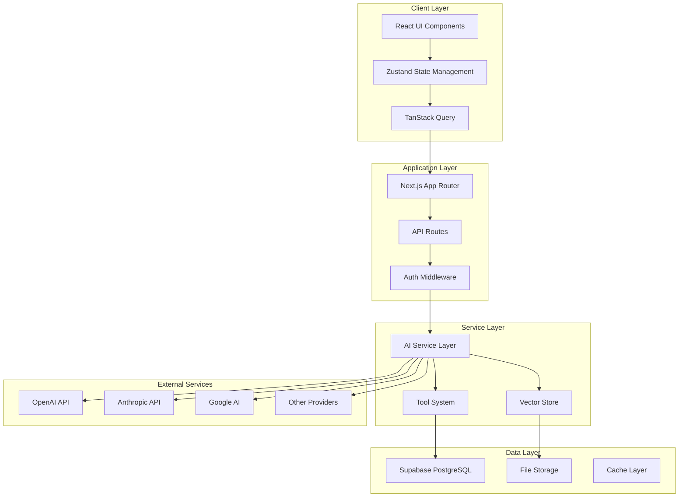
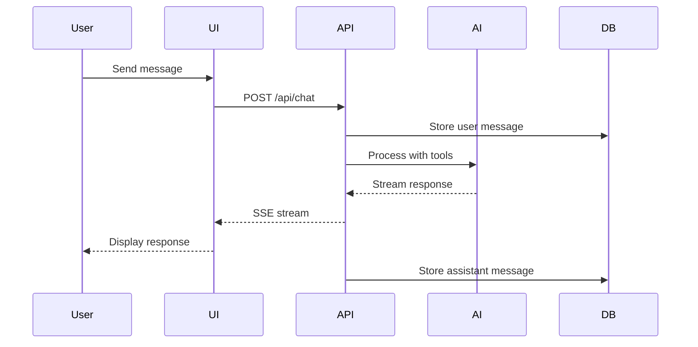
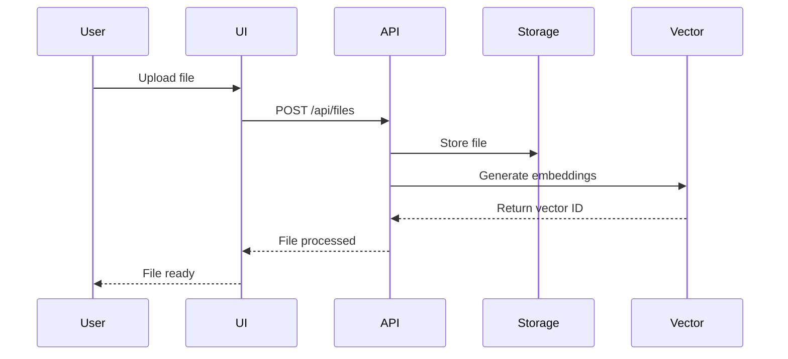
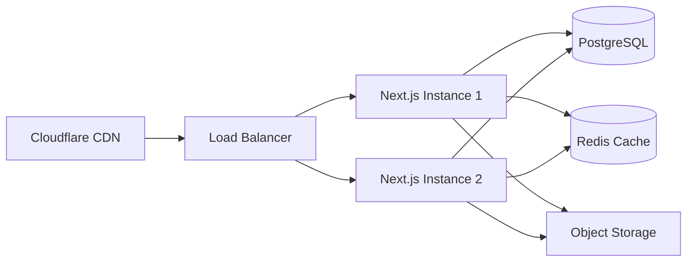

# 🏗️ Architecture Overview

## System Architecture

RoboChat follows a modern, scalable architecture built on Next.js 15 App Router with TypeScript. The application uses a client-server architecture with real-time streaming capabilities.



## Core Components

### 1. Frontend Architecture

#### Component Structure
```
app/
├── components/
│   ├── chat/              # Chat UI components
│   │   ├── conversation.tsx
│   │   ├── message.tsx
│   │   └── message-list.tsx
│   ├── multi-chat/        # Multi-chat management
│   ├── ui/                # Reusable UI components
│   └── providers/         # Context providers
```

#### State Management
- **Zustand**: Global state for user preferences, chat state
- **TanStack Query**: Server state management and caching
- **React Context**: Theme, authentication context

### 2. Backend Architecture

#### API Routes Structure
```
app/api/
├── chat/
│   ├── route.ts          # Main chat endpoint
│   ├── db.ts             # Database operations
│   └── utils.ts          # Chat utilities
├── feedback/
│   └── route.ts          # Feedback handling
├── files/
│   └── route.ts          # File operations
└── auth/
    └── callback/
        └── route.ts      # Auth callbacks
```

#### Service Layer
- **AI Service**: Manages provider selection and streaming
- **Tool System**: Extensible tool framework
- **Vector Store**: Document embedding and retrieval
- **Cache Service**: Redis-like caching with IDB

### 3. Database Schema

```sql
-- Core Tables
CREATE TABLE chats (
    id UUID PRIMARY KEY,
    user_id UUID REFERENCES auth.users,
    title TEXT,
    model TEXT,
    created_at TIMESTAMP,
    updated_at TIMESTAMP
);

CREATE TABLE messages (
    id UUID PRIMARY KEY,
    chat_id UUID REFERENCES chats,
    role TEXT CHECK (role IN ('user', 'assistant', 'system')),
    content JSONB,
    created_at TIMESTAMP
);

CREATE TABLE user_api_keys (
    id UUID PRIMARY KEY,
    user_id UUID REFERENCES auth.users,
    provider TEXT,
    encrypted_key TEXT,
    created_at TIMESTAMP
);

CREATE TABLE vector_stores (
    id UUID PRIMARY KEY,
    user_id UUID REFERENCES auth.users,
    name TEXT,
    provider TEXT,
    metadata JSONB
);
```

## Data Flow

### 1. Message Processing Flow



### 2. File Processing Flow



## Key Design Patterns

### 1. Provider Pattern
All AI providers implement a common interface:
```typescript
interface AIProvider {
  generateResponse(messages: Message[]): AsyncGenerator<Delta>
  embedText(text: string): Promise<number[]>
  supportsTools(): boolean
}
```

### 2. Tool Pattern
Tools follow a standardized structure:
```typescript
interface Tool {
  name: string
  description: string
  inputSchema: z.ZodSchema
  execute(input: unknown): Promise<ToolResult>
}
```

### 3. Message Handling
Using AI SDK v5's extended message format:
```typescript
interface ExtendedUIMessage {
  content?: string          // v4 compatibility
  parts?: MessagePart[]     // v5 format
  role: 'user' | 'assistant'
  attachments?: Attachment[]
}
```

## Security Architecture

### Authentication Flow
1. User initiates login via Supabase Auth
2. OAuth/Magic Link authentication
3. Session token stored in httpOnly cookie
4. RLS policies enforce data access

### API Security
- Rate limiting per user/IP
- Input sanitization
- CSRF protection
- API key encryption at rest

## Performance Optimizations

### 1. Code Splitting
- Route-based splitting with Next.js
- Dynamic imports for heavy components
- Lazy loading for providers

### 2. Caching Strategy
- Browser cache for static assets
- IDB for client-side data
- Server-side response caching
- Vector store caching

### 3. Streaming Architecture
- Server-Sent Events for real-time updates
- Chunked responses for large files
- Progressive rendering

## Deployment Architecture

### Production Setup


## Monitoring & Observability

### Metrics Collection
- Application metrics via OpenTelemetry
- AI interactions via LangSmith
- Error tracking via Sentry
- Performance monitoring via Vercel Analytics

### Health Checks
```typescript
GET /api/health
{
  "status": "healthy",
  "database": "connected",
  "cache": "connected",
  "providers": {
    "openai": "available",
    "anthropic": "available"
  }
}
```

## Scalability Considerations

### Horizontal Scaling
- Stateless application design
- Session storage in database
- Shared cache layer
- Load balancing support

### Vertical Scaling
- Efficient memory usage
- Streaming responses
- Lazy loading
- Connection pooling

## Technology Decisions

### Why Next.js 15?
- App Router for better performance
- Built-in API routes
- Excellent TypeScript support
- Server Components support

### Why Supabase?
- Built-in authentication
- Real-time subscriptions
- Row Level Security
- Managed PostgreSQL

### Why AI SDK v5?
- Unified provider interface
- Built-in streaming support
- Tool calling support
- Type safety

## Future Architecture Considerations

### Planned Improvements
1. **Microservices**: Extract AI processing to separate service
2. **WebSockets**: Real-time collaboration features
3. **GraphQL**: More efficient data fetching
4. **Edge Functions**: Reduced latency for global users
5. **Queue System**: Background job processing

### Scaling Strategy
- Database read replicas
- Multi-region deployment
- CDN for static assets
- Service mesh for microservices