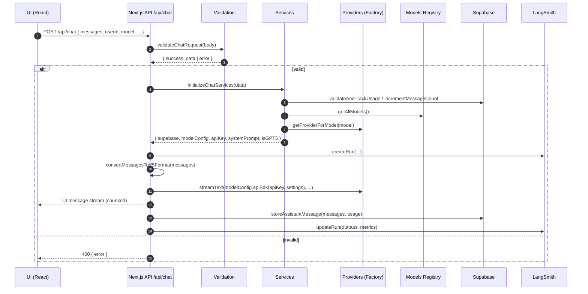
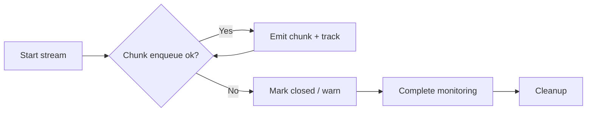

### Data Flow and Sequence

```mermaid
sequenceDiagram
  autonumber
  participant U as UI (React)
  participant R as Next.js API /api/chat
  participant V as Validation
  participant S as Services
  participant P as Providers (Factory)
  participant M as Models Registry
  participant DB as Supabase
  participant LS as LangSmith

  U->>R: POST /api/chat { messages, userId, model, ... }
  R->>V: validateChatRequest(body)
  V-->>R: { success, data | error }
  alt valid
    R->>S: initializeChatServices(data)
    S->>DB: validateAndTrackUsage / incrementMessageCount
    S->>M: getAllModels()
    S->>P: getProviderForModel(model)
    S-->>R: { supabase, modelConfig, apiKey, systemPrompt, isGPT5 }
    R->>LS: createRun(...)
    R->>R: convertMessagesToV5Format(messages)
    R->>P: streamText(modelConfig.apiSdk(apiKey, settings), ...)
    R-->>U: UI message stream (chunked)
    R->>DB: storeAssistantMessage(messages, usage)
    R->>LS: updateRun(outputs, metrics)
  else invalid
    R-->>U: 400 { error }
  end
```

Error and Monitoring Flow:

```mermaid
flowchart LR
  A[Start stream] --> B{Chunk enqueue ok?}
  B -- Yes --> C[Emit chunk + track]
  C --> B
  B -- No --> D[Mark closed / warn]
  D --> E[Complete monitoring]
  E --> F[Cleanup]
```
