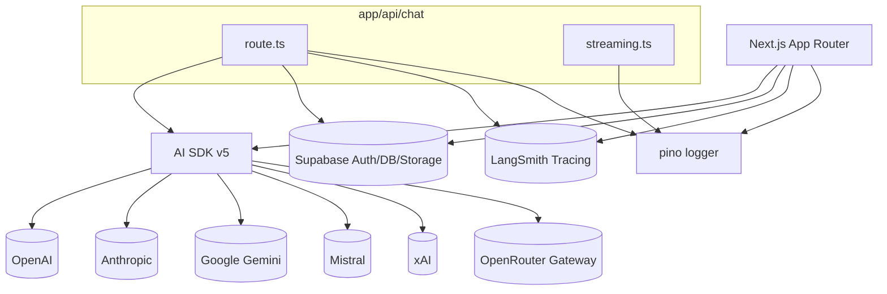

# External Dependencies & Integrations

This project integrates multiple provider SDKs, storage/auth, and observability tools.

## Libraries of Note (runtime)
- AI SDK v5: `ai`, `@ai-sdk/react`, provider packages (`@ai-sdk/openai`, `@ai-sdk/anthropic`, `@ai-sdk/google`, `@ai-sdk/mistral`, `@ai-sdk/xai`, `@openrouter/ai-sdk-provider`)
- State & UI: `react`, `zustand`, `@tanstack/react-query`, Radix UI libs, `lucide-react`
- Data/Storage/Auth: `@supabase/ssr`, `@supabase/supabase-js`
- Observability: `pino`, `pino-pretty`, `langsmith`
- Content: `react-markdown`, `remark-gfm`, `shiki`, `dompurify`

## Testing & Tooling (dev)
- Testing: `vitest`, `@testing-library/*`, `@playwright/test`, `msw`
- Lint/Format: `eslint`, `eslint-config-next`, `@biomejs/biome`, `prettier`, `ultracite`
- Build: `next`, `typescript`, `@next/bundle-analyzer`

## Integration Diagram

## Security & Config
- `next.config.ts` currently sets `ignoreDuringBuilds: true` for ESLint and `ignoreBuildErrors: true` for TypeScript. Remove before production to enforce quality gates.
- Secrets must be provided via environment variables; never hard-code keys. Example: Supabase keys in `utils/supabase/middleware.ts` read from `process.env.NEXT_PUBLIC_SUPABASE_*`.
- If enabling server-side caching (Upstash), ensure credentials are read via env and used only in server code paths.
