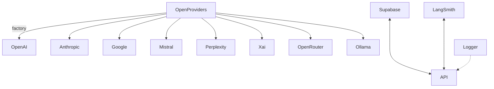

### Integrations and External Dependencies

- AI SDK v5 (`ai`, `@ai-sdk/*`): model streaming, tool invocation
- Providers: OpenAI, Anthropic, Google, Mistral, Perplexity, X.ai, OpenRouter; Ollama via OpenAI-compatible API
- Supabase: auth (guest + authenticated), user message logging, usage tracking
- LangSmith: run tracing and metrics (optional via env flags)
- Pino logger: structured logging with pretty output in dev
- Playwright & Vitest: E2E and unit tests
- Zod: used in tools; recommended for API validation expansion

Environment variables (non-exhaustive; no values shown):
- Provider keys: OPENAI_API_KEY, MISTRAL_API_KEY, GOOGLE_GENERATIVE_AI_API_KEY, PERPLEXITY_API_KEY, ANTHROPIC_API_KEY, XAI_API_KEY, OPENROUTER_API_KEY
- Ollama: OLLAMA_BASE_URL
- Supabase: NEXT_PUBLIC_SUPABASE_URL, NEXT_PUBLIC_SUPABASE_ANON_KEY, SUPABASE_SERVICE_ROLE
- Security: ENCRYPTION_KEY, ENCRYPTION_SALT, CSRF_SECRET
- Observability: LANGSMITH_API_KEY, LANGSMITH_TRACING, LANGSMITH_PROJECT

