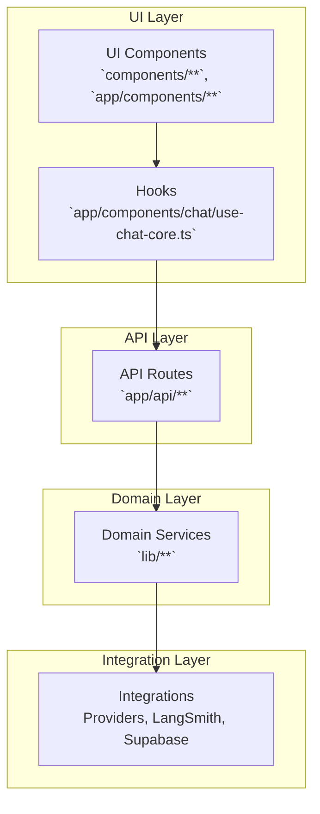

# Module Boundaries & Interfaces

This document outlines module ownership, interfaces, and recommended adapter patterns to maintain clean boundaries.

## High-Level Module Map

## Ownership & Responsibilities
- UI Layer (`components/`, `app/components/`)
  - Presentation and user interactions
  - No direct knowledge of providers or storage
  - Use hooks to call API routes
- API Layer (`app/api/**`)
  - Request validation (Zod)
  - Orchestration of domain services
  - Translate transport-layer DTOs to domain inputs/outputs
- Domain Layer (`lib/**`)
  - Business logic, policies, limits, configuration, logging
  - Provider-agnostic interfaces for LLM/tools/storage
  - Expose small, typed APIs (no Next/Request/Response types)
- Integration Layer (`lib/openproviders/**`, `lib/langsmith/*`, `lib/supabase/*`)
  - Adapter implementations for external systems
  - Replaceable via dependency injection

## Key Interfaces (suggested)
- LLMProvider
  - `complete(messages, options): AsyncIterable<Chunk> | Stream` (stream-first)
  - `modelCapabilities(model): Capabilities`
- ChatRepository
  - `saveUserMessage(message)` / `saveAssistantMessage(message, usage)`
  - back by Supabase but replaceable for tests
- CacheStore
  - `get(key): Promise<string|null>`
  - `setex(key, ttl, value)`
  - implementations: Upstash Redis, in-memory (dev), noop
- Telemetry
  - `start(runCtx)` / `finish(runId, result)` / `event(name, props)`
  - LangSmith-backed when enabled

## Current Boundary Issues & Actions
- __Caching in server route uses `sessionStorage`__ (`app/api/chat/streaming.ts`).
  - Action: Introduce `CacheStore` interface in `lib/cache/` with server-safe implementations.
- __`next.config.ts` disables TS and ESLint at build__.
  - Action: Re-enable to enforce boundary contracts and type safety.
- __UI components possibly import heavy deps eagerly__ (e.g., `shiki`).
  - Action: Dynamic import in integration layer or per-feature boundary to keep UI light.

## DDD Grouping (proposed folders)
- `domain/chat/` — core chat entities, value objects, ports
- `application/chat/` — use-cases (orchestrations) agnostic of web
- `infrastructure/` — adapters (Supabase, Upstash, LangSmith, AI providers)
- `web/` — Next.js routes, handlers mapping to application use-cases

This can be gradually introduced alongside existing `lib/**` without a big-bang migration.
